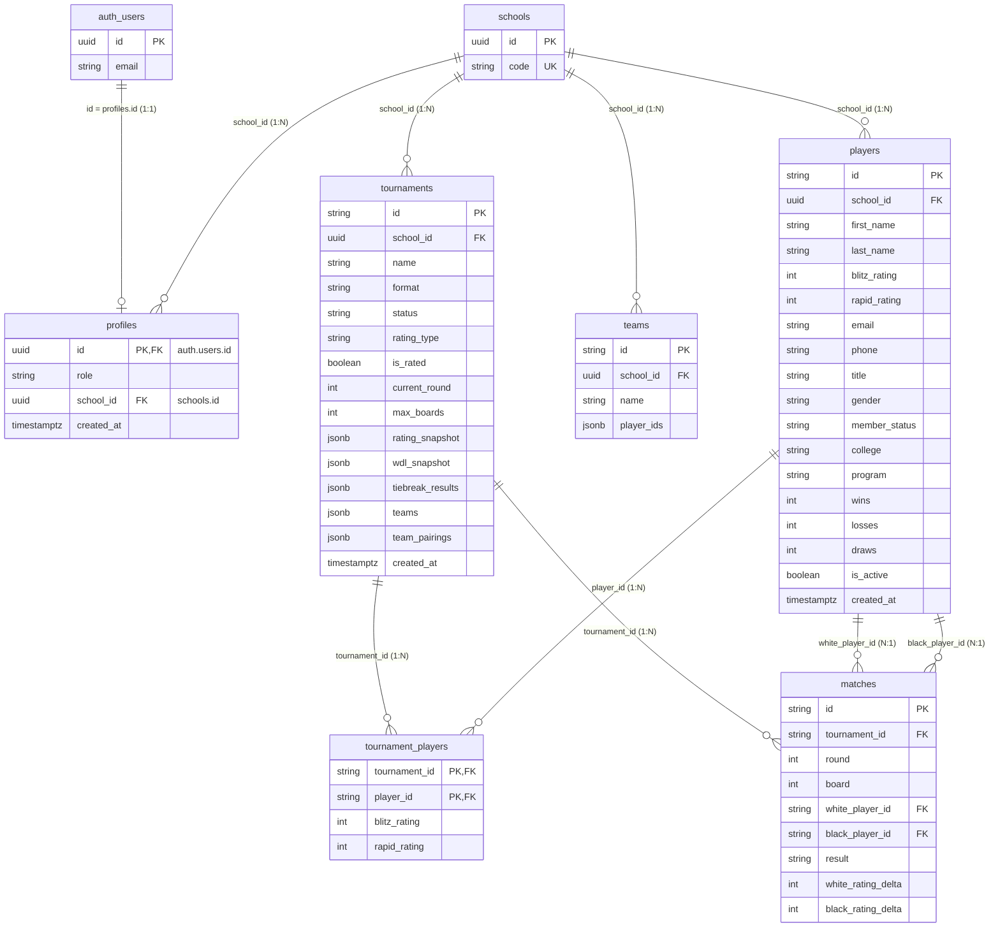

# Chess Manager — Database Architecture (Migration Phase 2)

A full scan of every database model, query, and persistence path in the
repository, compiled into a data dictionary and ERD structure.

---

## 0. Critical Finding: Where Is the Schema Defined?

The repository contains **no `.sql` files, no `migrations/` directory, no
`supabase/` folder, no ORM classes, and no separate schema/DDL scripts**.
The entire database contract is expressed **inside the Dart source code** via
the `supabase_flutter` PostgREST client:

- **Table names & columns** are defined *implicitly* by the `select(...)`
  projections, `upsert({...})` row maps, and `.eq('column', ...)` filters in
  `lib/services/supabase_db.dart` and `lib/pages/accounts_page.dart`.
- **Row-Level Security (RLS)** is defined *out-of-band* (manually in the
  Supabase dashboard / SQL editor) and only *referenced* in code comments
  (see `accounts_page.dart` lines 14–26 and `supabase_db.dart`).
- **Auth** (`profiles`, `schools`) is accessed through the Supabase Auth +
  PostgREST layer; invite flows use the auth API (`signInWithOtp`), not SQL.

Consequently, this document reconstructs the data dictionary from the Dart
json maps and query projections, and flags every schema fact that must be
confirmed/created in Supabase as part of the migration.

> **Migration implication:** The actual DDL (CREATE TABLE, indexes,
> foreign keys, cascade rules, RLS policies, and triggers) lives only in the
> Supabase project, not in this repo. Phase 2 must either (a) extract the live
> schema from Supabase, or (b) regenerate DDL from the maps below.

---

## 1. Tables & Columns (Derived Data Dictionary)

The application touches **8 database objects** (7 tables + 1 auth view).
Types are inferred from the Dart casts used in `supabase_db.dart` and
`accounts_page.dart`. `⇨` = value derived/written by app logic.

### 1.1 `players`
Player roster. **scoped by `school_id`.**

| Column | Dart read cast | Written as | Default | Constraint / Notes |
|--------|---------------|-----------|---------|--------------------|
| `id` | `String` | `p.id` | — | PK (app-generated 6-digit string, ≥100000) |
| `school_id` | (filter only) | `_sid` | — | **FK → `schools.id`**; used in every RLS policy + query filter |
| `first_name` | `String` | `p.firstName` | — | |
| `last_name` | `String` | `p.lastName` | — | ORDER BY `last_name` on load |
| `blitz_rating` | `int` | `p.blitzRating` | `1500` (legacy) | Int |
| `rapid_rating` | `int` | `p.rapidRating` | `1500` (legacy) | Int |
| `email` | `String?` | `p.email` | `null` | Nullable |
| `phone` | `String?` | `p.phone` | `null` | Nullable |
| `title` | `String?` → `''` | `p.title` | `''` | FIDE title: GM/IM/FM/CM/NM/`''` |
| `gender` | `enum name` | `p.gender.name` | `'male'` | `male`/`female`/`other` |
| `member_status` | `enum name` | `p.memberStatus.name` | `'member'` | `member`/`guest` |
| `college` | `String?` → `''` | `p.college` | `''` | College (members) / school (guests) |
| `program` | `String?` → `''` | `p.program` | `''` | Course/degree or grade |
| `wins` | `int?` → `0` | `p.wins` | `0` | Recomputable from matches (see lifecycle) |
| `losses` | `int?` → `0` | `p.losses` | `0` | |
| `draws` | `int?` → `0` | `p.draws` | `0` | |
| `is_active` | `bool?` → `true` | `p.isActive` | `true` | Soft-delete / active flag |
| `created_at` | `DateTime` | `p.createdAt` (ISO8601) | `now()` | |

**Indexes (inferred, from query shape):** `(school_id)` — every filter uses
`.eq('school_id', _sid)`; `(last_name)` — ORDER BY.

---

### 1.2 `teams`
**Reusable, tournament-independent** saved team rosters. `school_id` scoped.

| Column | Read cast | Written as | Default | Constraint / Notes |
|--------|-----------|-----------|---------|--------------------|
| `id` | `String` | `t.id` | — | PK (app-generated) |
| `school_id` | — | `_sid` | — | **FK → `schools.id`**; RLS-scoped |
| `name` | `String` | `t.name` | — | ORDER BY `name` on load |
| `player_ids` | `List<String>` | `t.playerIds` | — | `jsonb` array of player IDs (ordered = board order); **no FK enforcement** |

---

### 1.3 `tournaments`
Tournament metadata + **jsonb snapshots**. `school_id` scoped.

| Column | Read cast | Written as | Default | Constraint / Notes |
|--------|-----------|-----------|---------|--------------------|
| `id` | `String` | `t.id` | — | PK (app-generated) |
| `school_id` | — | `_sid` | — | **FK → `schools.id`**; RLS-scoped |
| `name` | `String` | `t.name` | — | ORDER BY `created_at` on load |
| `format` | `enum name` | `t.format.name` | `'swiss'` | `roundRobin`/`knockout`/`swiss` |
| `status` | `enum name` | `t.status.name` | `'draft'` | `draft`/`inProgress`/`completed` |
| `rating_type` | `enum name` | `t.ratingType.name` | `'rapid'` | `blitz`/`rapid` |
| `is_rated` | `bool?` → `true` | `t.isRated` | `true` | |
| `current_round` | `int?` → `0` | `t.currentRound` | `0` | |
| `max_boards` | `int?` | `t.maxBoards` | `null` | Non-null ⇔ team tournament |
| `rating_snapshot` | `Map<String,int>` | `t.ratingSnapshot` | `{}` | `jsonb`, playerId→pre-finalization rating |
| `wdl_snapshot` | `Map<String,{wins,draws,losses}>` | `t.wdlSnapshot` | `{}` | `jsonb`, playerId→record |
| `tiebreak_results` | `Map<String,String>` | `t.tiebreakResults` | `{}` | `jsonb`, `"<idA>_<idB>"`→winnerId |
| `teams` | `List<Team>` | `t.teams` (array of Team.json) | `[]` | `jsonb`; present ⇔ team tournament |
| `team_pairings` | `List<List<TeamRoundPairing>>` | `t.teamRoundPairings` | `[]` | `jsonb`; parallel to rounds |
| `created_at` | `DateTime` | `t.createdAt` (ISO8601) | `now()` | |

---

### 1.4 `tournament_players`
**Join table**: tournament ↔ player roster snapshot (rating at enrollment time).

| Column | Read cast | Written as | Default | Constraint / Notes |
|--------|-----------|-----------|---------|--------------------|
| `tournament_id` | `String` | `t.id` | — | **FK → `tournaments.id`** (cascade delete via parent) |
| `player_id` | `String` | `p.id` | — | **FK → `players.id`** |
| `blitz_rating` | `int` | `p.blitzRating` | — | Rating snapshot at enrollment |
| `rapid_rating` | `int` | `p.rapidRating` | — | |

**Indexes (inferred):** `(tournament_id)` — bulk `inFilter('tournament_id', ...)`.

---

### 1.5 `matches`
One row per `ChessMatch`. **Composite unique key** on tournament/round/board.

| Column | Read cast | Written as | Default | Constraint / Notes |
|--------|-----------|-----------|---------|--------------------|
| `id` | `String` | `m.id` | — | PK (app-generated, e.g. `m01`) |
| `tournament_id` | `String` | `t.id` | — | **FK → `tournaments.id`** (cascade delete) |
| `round` | `int` | `m.round` | — | ORDER BY `round` |
| `board` | `int` | `m.board` | — | ORDER BY `board` |
| `white_player_id` | `String?` | `m.white?.id` | — | **FK → `players.id`**; **null = bye** |
| `black_player_id` | `String?` | `m.black?.id` | — | **FK → `players.id`**; **null = bye** |
| `result` | `enum name` | `m.result.name` | `'pending'` | `pending`/`whiteWins`/`blackWins`/`draw`/`bye` |
| `white_rating_delta` | `int?` | `m.whiteRatingDelta` | `null` | Set at finalization |
| `black_rating_delta` | `int?` | `m.blackRatingDelta` | `null` | Set at finalization |

**Indexes (inferred):** `(tournament_id, round, board)` — the ORDER BY +
`inFilter('tournament_id', ...)` pattern.

---

### 1.6 `profiles`
Auth-linked user profile. **PK is a UUID from Supabase Auth.**

| Column | Read cast | Written as | Default | Constraint / Notes |
|--------|-----------|-----------|---------|--------------------|
| `id` | `String` (UUID) | — | — | **PK = `auth.users.id`** (FK to auth) |
| `email` | (from `auth.currentUser`) | — | — | Not stored per code note; read from auth session; email privacy |
| `role` | `String?` → `'player'` | `{'role': newRole}` | `'player'` | `player`/`school_admin`/`super_admin` |
| `school_id` | `String?` | — | — | **FK → `schools.id`**; nullable |
| `created_at` | `DateTime` | — | — | ORDER BY |

**RLS policies referenced in code** (must exist in Supabase):
- `admins read school profiles` — SELECT where `school_id = my_school_id()` and role ∈ {`school_admin`, `super_admin`} (comment, `accounts_page.dart:16`)
- `admins update school profiles` — UPDATE with same predicate (comment, `accounts_page.dart:22`)
- Public read for `profiles`/`schools` enabling `school_id` resolution without auth.

---

### 1.7 `schools`
School lookup table (public access by code).

| Column | Read cast | Written as | Default | Constraint / Notes |
|--------|-----------|-----------|---------|--------------------|
| `id` | `String` | — | — | PK (UUID) |
| `code` | `String` | — | — | Unique lookup key (e.g. `'UMCCC'`); **`.eq('code', schoolCode).single()`** |

---

### 1.8 `auth.users` (Supabase Managed)
Read indirectly: `auth.currentUser` (id/email). Not directly queried via
PostgREST; emails for other users are masked in the UI.

---

## 2. Relationships & Referential Integrity

| From | To | Type | FK Column(s) | Cascade behavior |
|------|----|------|--------------|------------------|
| `profiles` | `auth.users` | **One-to-One** | `profiles.id` = `auth.users.id` | Implied by auth |
| `profiles` | `schools` | **Many-to-One** | `profiles.school_id` → `schools.id` | per RLS |
| `players` | `schools` | **Many-to-One** | `players.school_id` → `schools.id` | per RLS |
| `teams` | `schools` | **Many-to-One** | `teams.school_id` → `schools.id` | per RLS |
| `tournaments` | `schools` | **Many-to-One** | `tournaments.school_id` → `schools.id` | per RLS |
| `tournament_players.tournament_id` | `tournaments` | **One-to-Many** | `tournament_id` → `tournaments.id` | **ON DELETE CASCADE** (comment: "Cascade deletes handle tournament_players and matches automatically", `supabase_db.dart:364`) |
| `tournament_players.player_id` | `players` | **Many-to-One** | `player_id` → `players.id` | — |
| `matches.tournament_id` | `tournaments` | **One-to-Many** | `tournament_id` → `tournaments.id` | **ON DELETE CASCADE** (same comment) |
| `matches.white_player_id` | `players` | **Many-to-One** | `white_player_id` → `players.id` | nullable; null = bye |
| `matches.black_player_id` | `players` | **Many-to-One** | `black_player_id` → `players.id` | nullable; null = bye |

### Many-to-Many relationships
- **Tournament ⇄ Player (M:N)** is modeled through the **`tournament_players`**
  association table. Both FKs have FK constraints.
- **Teams (`teams.player_ids`) and tournament `teams` jsonb boardSlots** store
  *references* to player IDs, but as **`jsonb` arrays — NOT enforced FK
  columns**. Pointing at a nonexistent player would not be rejected at the DB
  level; integrity is maintained by the app.

### Soft-delete
- **Players** use the `is_active` boolean flag (soft-delete). The UI toggles
  this via `onToggleActive`; inactive players are hidden from pickers and old
  tournament history is preserved. There is **no `deleted_at` timestamp**.
- Direct hard-deletes still occur via `players.delete().eq('id', id)`.
- **Tournaments / teams** are hard-deleted by id (cascade removes
  `tournament_players` and `matches`; deleting a team does not touch players).

---

## 3. Complex Queries

There are **no SQL JOINs, CTEs, database aggregations, stored procedures, or
triggers written in this repo.** All joins/aggregations are performed
**in Dart application code**, and every database access is a simple PostgREST
call. The full inventory of database operations:

### Multi-table reads (client-side joins in Dart)
- **`SupabaseDb.loadTournaments()`** (`supabase_db.dart:168`) — the only
  true multi-table read. Issues **three** queries (metadata + 2 bulk `IN`
  fetches) and joins them in Dart:
  1. `tournaments` WHERE `school_id` ORDER BY `created_at`
  2. `tournament_players` WHERE `tournament_id IN (…)` (`.inFilter`)
  3. `matches` WHERE `tournament_id IN (…)` ORDER BY `round, board`
  → reassembles roster and per-round match lists in memory.
- **`accounts_page.dart:87`** — `profiles` SELECT `id, role, school_id,
  created_at` ORDER BY `created_at`; emails joined from the in-memory auth
  session (not SQL).
- **`SupabaseDb.init()`** — `profiles` SELECT `school_id` WHERE `id = uid`
  (`.single()`).
- **`SupabaseDb.initPublic()`** — `schools` SELECT `id` WHERE `code = ?`
  (`.single()`).
- **`accounts_page.dart:125`** — `profiles` SELECT `role` WHERE `id = ?`
  (`.single()`).

### Write operations
- `players`: `.upsert(rows)` (insert+update), `.upsert` single, `.delete().eq('id')`.
- `teams`: `.upsert(rows)`, `.delete().eq('id')`.
- `tournaments`: `.upsert({metadata jsonb})`, then `tournament_players`
  `.upsert(...)`, then `matches` `.upsert(...)` (always a **3-step transaction-
  per-tournament** save), plus `.delete().eq('id')`.
- `profiles`: `.update({'role': newRole}).eq('id')` (via `accounts_page.dart:179`).

### Aggregations (computed in Dart, not SQL)
- Standings & all tiebreaks (`Tournament.standings`): points, wins/draws/losses,
  progressive score, Buchholz, Buchholz-Cut-1, Sonneborn-Berger, direct
  encounter — all computed from the in-memory `rounds` list.
- Team standings (`Tournament.teamStandings`): match points, board points.
- Elo changes (`RatingService`): expected score, K-factor, per-game deltas.
- W/D/L rollup (`MainScreen._recalculateWdl`): replays completed tournaments.

### Supabase/Auth API calls (not SQL)
- `auth.signInWithPassword` (login), `auth.signOut` (logout),
  `auth.signInWithOtp` (magic-link invite), `auth.onAuthStateChange` (session).

**No `.rpc()` calls, no raw SQL strings, no Postgres functions/views/triggers
are summoned from the code.**

---

## 4. Data Modification Lifecycle

### Write orchestration (from `main.dart` — single state owner)
All mutations flow **upward** through `_MainScreenState` callbacks into the
persistence layer (there is no ORM layer or pre/post-save hook library):

1. **New player** → `_persistNewPlayer` → `SupabaseDb.savePlayer` (upsert).
   On failure → `PendingSyncService.queue(players:[p])`.
2. **New tournament** → `_persistTournament(t, playersToSync: t.players)` →
   save players first (avoids FK race), then `SupabaseDb.saveTournament`
   (3-step upsert: metadata → `tournament_players` → `matches`).
3. **Update tournament** (round progress, match results) → `_persistTournament`
   with **no** `playersToSync` (avoids clobbering concurrent profile edits).
4. **Finalize tournament** → rating/W-D-L applied in Dart, then
   `_finalizeTournament` → save players + tournament; on failure →
   `PendingSyncService.queue` with **full roster** for later reconstruction.
5. **Add latecomers** → `_addLatecomers` → `_persistTournament(playersToSync: newPlayers)`.
6. **Delete** → hard delete by id (cascade removes children).

### Offline queue (deferred write lifecycle)
`PendingSyncService` (shared_preferences):
- **enqueue**: on any failed create/update/finalize; replaces any prior queued
  entry for the same tournament id (no duplicates).
- **drain**: `trySyncAll` on next launch (`_loadAll`) and via **Sync Now**
  (`_syncPendingNow`). Ordering: players first, then the tournament; a failing
  entry stays queued for the next attempt.

### Hooks / triggers
- **No pre-save / post-save hooks, no DB triggers, no stored procedures** in
  the repo. The nearest analogues to hooks are:
  - **Manual role assignment after invite**: the code *intends* a
    "trigger or manual step inserts their profile row" on first login
    (`accounts_page.dart:480`), but no such trigger is defined in-repo — it
    must exist in the Supabase project.
  - **In-application recalculations** acting as idempotent backfill/fix hooks:
    `_recalculateWdl` and `_recalculateMatchRatingDeltas` (Dashboard
    maintenance).

### Soft-delete mechanisms
- Player **`is_active`** boolean soft-delete (only mechanism); no `deleted_at`.
- Tournaments/teams: hard delete with FK cascade.

---

## 5. ERD Structure (Mermaid + text)



### Text ERD (relationships only)

```
auth.users ──(1:1)── profiles
schools ────(1:N)── profiles / players / teams / tournaments
tournaments ──(1:N)── tournament_players ──(N:1)── players
tournaments ──(1:N)── matches ──(N:1)── players (white, black)
tournaments ──(jsonb)── teams[] ──(jsonb reference)── players
teams ──(jsonb)── player_ids[] ──(reference, no FK)── players
```

---

## 6. Migration / Schema-Action Checklist

Because the DDL lives only in the remote Supabase project, the migration must
confirm or create:

1. **All 7 tables** with the columns/indexes above.
2. **FK constraints** — especially `tournament_players` and `matches` →
   `tournaments` with **`ON DELETE CASCADE`** (relied on by
   `deleteTournament`).
3. **`schools.code` unique** index (`.single()` lookup assumes uniqueness).
4. **Indexes**: `players(school_id)`, `teams(school_id)`,
   `tournaments(school_id)`, `tournament_players(tournament_id)`,
   `matches(tournament_id, round, board)`.
5. **RLS policies** (`admins read school profiles`, `admins update school
   profiles`, public `schools`/`profiles` read for `school_id` resolution,
   per-school data isolation on all 4 scoped tables).
6. **Auth pipeline**: profile-row creation trigger on new user signup
   (referenced but not defined in-repo), role assignment after invite.
